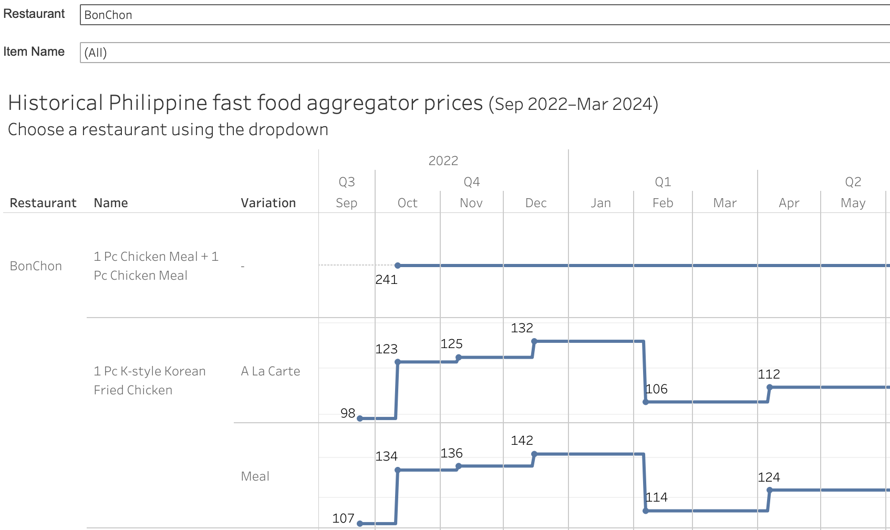

# 🍔 Biteflation
An open dataset of Philippine fast food aggregator prices

## Coverage
* Daily menu data from September 2022 to March 2024
* Manila branch of BonChon, Chowking, Greenwich, Jollibee, KFC, Mang Inasal, and McDonald's

## Demo

[View the Tableau Public visualization here](https://public.tableau.com/app/profile/chechu.siscar/viz/FastFoodPriceTrends/GraphView)

## Available resources in this repo

* `output` - Processed `*.csv` versions of menu item price dataset
* `input`
	* `download.py` - Utility to download data from the food aggregator’s undocumented API
	* `sample-yyyymmdd.json` - Sample `*.json` file downloaded for one restaurant as of a particular date 
	* `action.yml` - GitHub action file to automate running `download.py`
* `process` - *Coming soon*